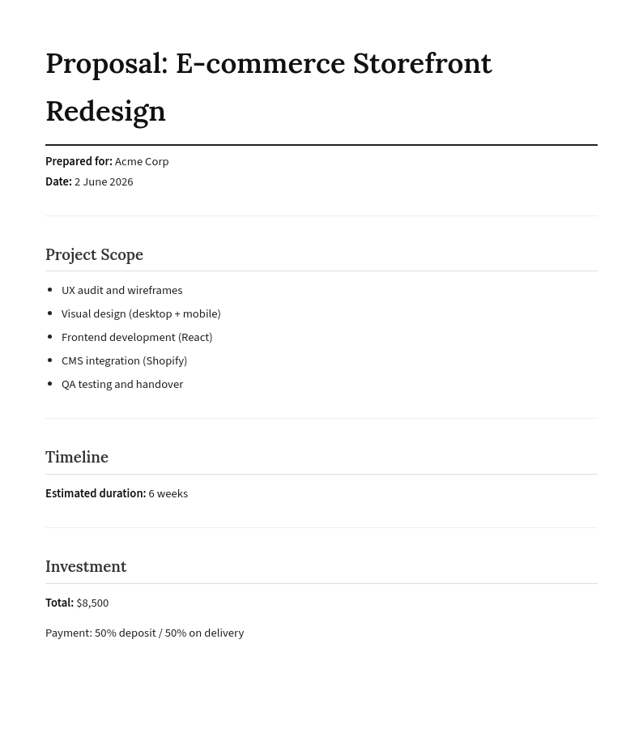
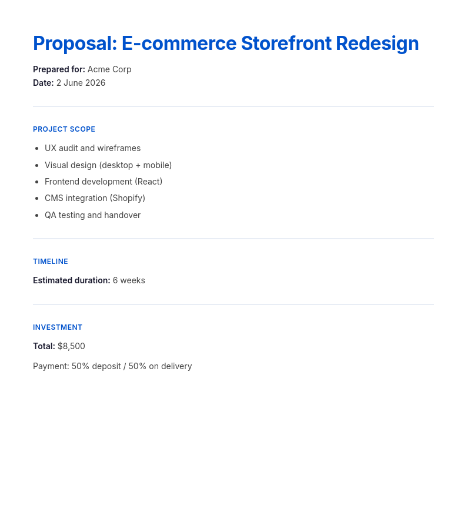
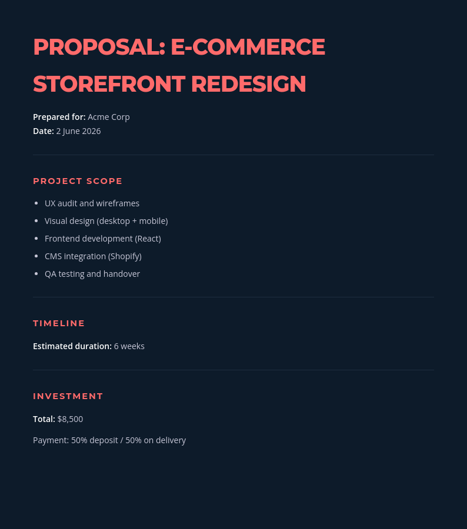
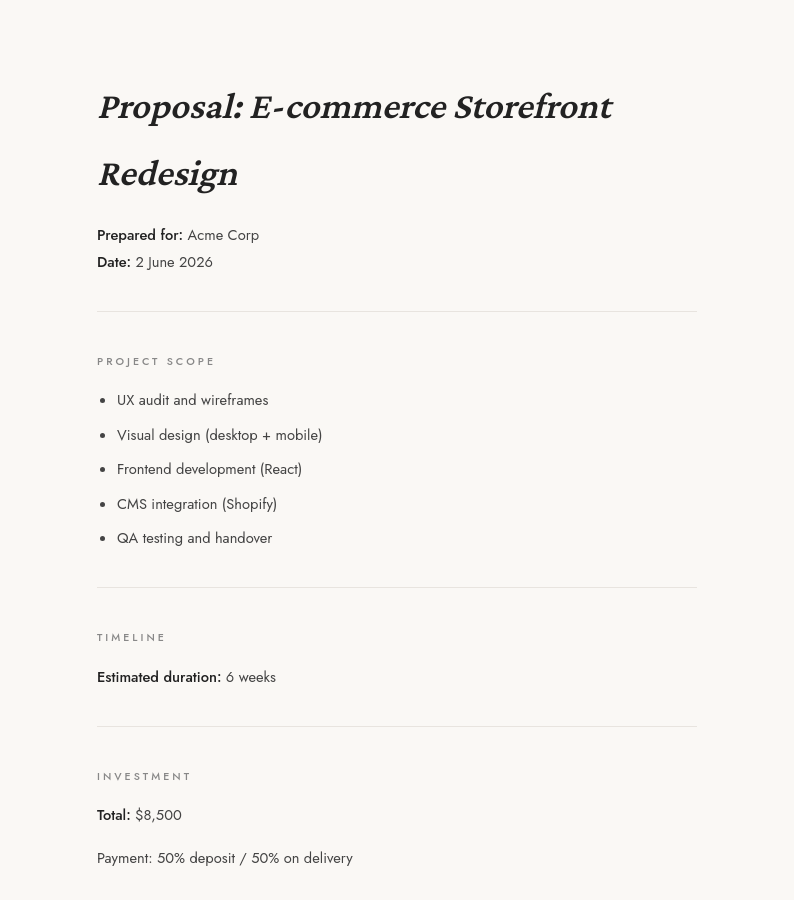
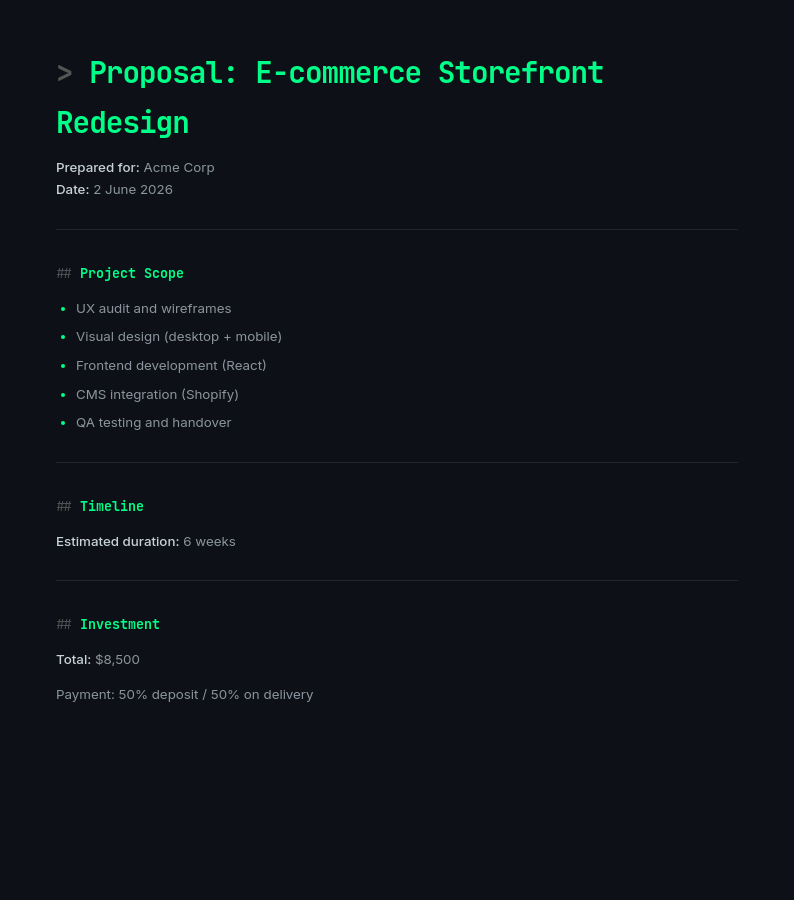
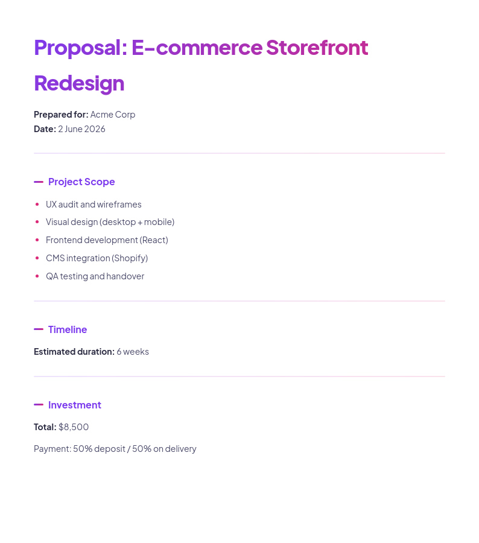

# ProposalKit

```
  ____                               _ _  ___ _
 |  _ \ _ __ ___  _ __   ___  ___  | | |/ (_) |_
 | |_) | '__/ _ \| '_ \ / _ \/ __| | | ' /| | __|
 |  __/| | | (_) | |_) | (_) \__ \ | | . \| | |_
 |_|   |_|  \___/| .__/ \___/|___/ |_|_|\_\_|\__|
                  |_|
```

**CLI that generates polished proposal PDFs from bullet points.**

Free tier: Markdown output. Pro tier ($19): PDF export with 6 professional themes.

Built by [Paprika Labs](https://paprika-labs.app) — an AI lab building developer tools.

---

## Install

```bash
npm install -g proposalkit
```

Or use without installing:

```bash
npx proposalkit --help
```

---

## Usage

### Free — Generate a Markdown proposal

```bash
proposalkit \
  --client "Acme Corp" \
  --project "E-commerce Redesign" \
  --budget "\$8,500" \
  --timeline "6 weeks" \
  --scope "UX audit,Visual design,Frontend development,QA testing" \
  --about "Two-person UX studio, 20+ e-commerce projects."
```

Outputs `proposal.md` in the current directory.

**All options:**

| Flag | Description | Default |
|------|-------------|---------|
| `--client` | Client / company name | required |
| `--project` | Project title | required |
| `--budget` | Total budget (e.g. `$8,500`) | required |
| `--timeline` | Duration (e.g. `6 weeks`) | required |
| `--scope` | Comma-separated deliverables | required |
| `--about` | About you / your agency | required |
| `--output` | Output filename | `proposal.md` |

See [examples/example-output.md](examples/example-output.md) for a full sample proposal.

---

## Pro — PDF Export with 6 Themes

**[Get ProposalKit Pro — $19 one-time →](https://proposalkit.gumroad.com)**

Unlocks:
- PDF export via `--pdf` flag
- 6 professional themes via `--theme`
- Send-ready PDFs for client email attachments

### Themes

| Theme | Style | Preview |
|-------|-------|---------|
| `clean` | White, serif body, clean borders | \ |
| `modern` | Blue accent, flat design, uppercase headers | \ |
| `agency` | Dark navy, coral accent, bold Montserrat | \ |
| `minimal` | Cream bg, generous whitespace, Crimson serif | \ |
| `tech` | Dark mode, monospace, green accent | \ |
| `creative` | Purple-to-pink gradient headings, rounded | \ |

### Pro usage

```bash
PROPOSALKIT_PRO_KEY=your_key proposalkit \
  --client "Acme Corp" \
  --project "E-commerce Redesign" \
  --budget "\$8,500" \
  --timeline "6 weeks" \
  --scope "UX audit,Visual design,Frontend development" \
  --about "Two-person UX studio." \
  --pdf --theme modern \
  --output proposal-acme.pdf
```

---

## Build from source

```bash
git clone https://github.com/paprika-org/proposalkit
cd proposalkit
npm install
npm run build
node dist/cli.js --help
```

---

## License

MIT — free to use and modify.

---

*[ProposalKit Pro — PDF export + 6 themes →](https://proposalkit.gumroad.com)*

